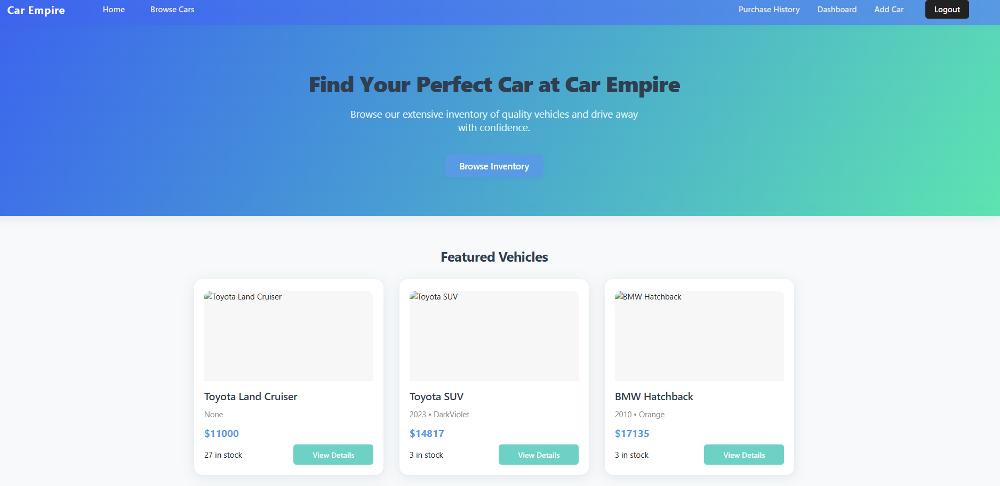
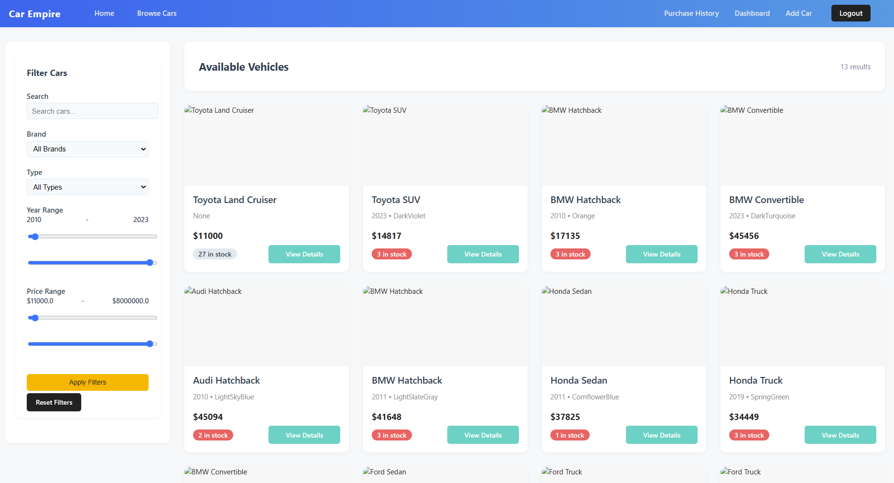
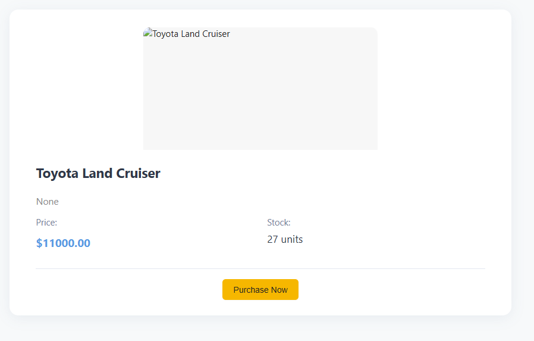
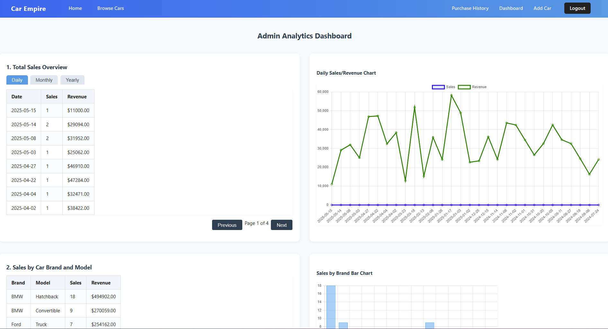

# Car Management DB Project

A web-based car dealership management system built with Flask and SQLite. This project allows users to browse, search, and purchase cars, while providing administrators with powerful analytics and management tools.


## Features

- User registration and login
- Car browsing with advanced search and filters (brand, model, year, price, etc.)
- Car detail pages with purchase option
- User purchase history
- Admin dashboard for:
  - Adding new cars
  - Viewing sales statistics and analytics
  - Monitoring stock and profit analysis
  - Customer insights and sales trends
- Database population script for demo data
- Responsive HTML templates for user and admin views

## Demo Screenshots

| Home Page | Cars Inventory | Car Details | Admin Analytics |
|-----------|---------------|-------------|-----------------|
|  |  |  |  |

## Getting Started

### Prerequisites
- Python 3.7+
- [pip](https://pip.pypa.io/en/stable/)

### Installation
1. **Clone the repository:**
   ```bash
   git clone https://github.com/yourusername/CarManagementDBProject.git
   ```
2. **Install dependencies:**
   ```bash
   pip install -r requirements.txt
   ```
   > _For demo data population, install Faker:_
   ```bash
   pip install Faker
   ```

### Database Setup
1. **Initialize the database schema:**
   ```bash
   sqlite3 dealership.db < schema.sql
   ```
2. **Populate with demo data (optional):**
   ```bash
   python populate_db.py
   ```

### Running the App
```bash
python app.py
```
Visit [http://127.0.0.1:5000/](http://127.0.0.1:5000/) in your browser.

- Default admin user: `admin` / `adminpass`

## Project Structure
```
CarManagementDBProject/
├── app.py                # Main Flask application
├── dealership.db         # SQLite database (generated)
├── schema.sql            # Database schema
├── populate_db.py        # Script to populate DB with demo data
├── requirements.txt      # Python dependencies
├── static/
│   └── car_images/       # Car images
├── images/               # Project images (e.g., logo)
├── templates/            # HTML templates
└── README.md             # Project documentation
```

## Security Note
- Passwords are stored in plain text for demo purposes. **Do not use in production!**
- Change `app.secret_key` in `app.py` before deploying.


**Made with Flask & SQLite** 
